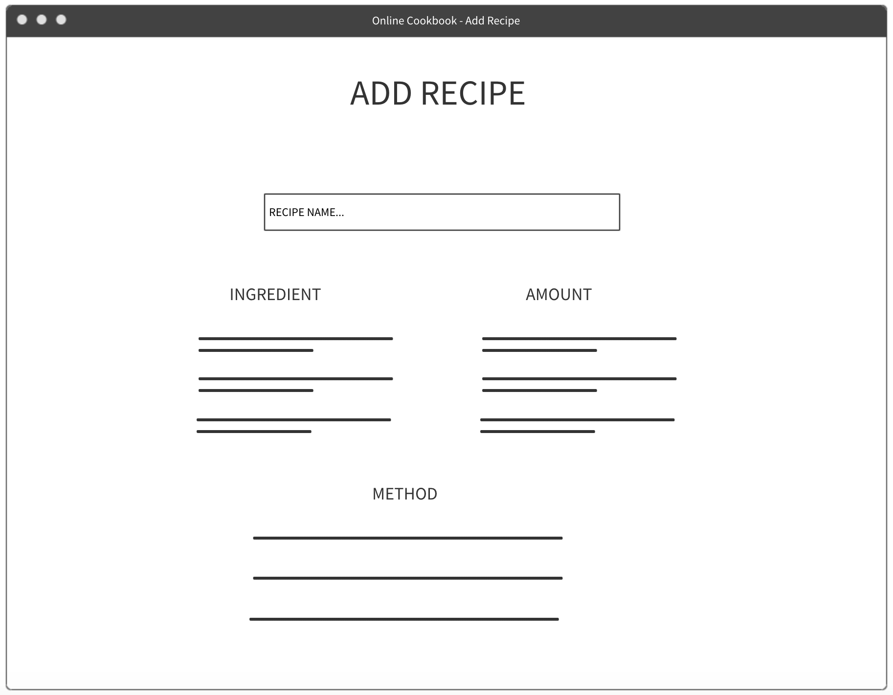
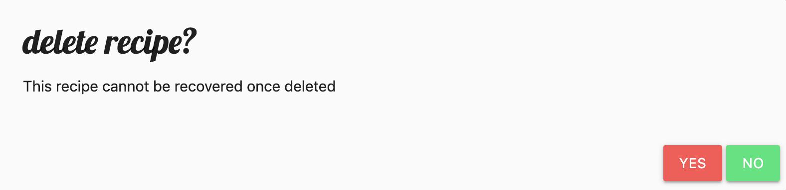

# [munch](https://online-cookbook-ci.herokuapp.com/)

This application uses the Flask micro web framework, along with a MongoDB database to allow users to gather all of their favourite recipes in one place.

New recipes can be added, edited and deleted from the website. Recipes can also be filtered by cuisine and sorted by number of views or likes.

 
## UX

The _munch_ online cookbook takes on a modern design by implementing features from the Materialize.css framework. A fixed navbar remains a constant theme throughout, with orange being the dominant colour throughout each of the templates (e.g. form input underlines).

A sidenav consisting of the munch logo, as well as options to filter and sort has been implemented (detail of which can be found in the Features section below).

All of the recipes on the home page are displayed on Materialize `cards`, each showing a photo of the recipe, the recipe title and it's difficulty. Users can also see how many views that particular recipe has attracted as well as likes. By pressing the thumb button on the homepage, the user can like a recipe at a glance.

### Add Recipe

The user is redirected to this page when they would like to add a recipe of their own. On this page are a number of inputs that the user must fill in. Each follows the colour scheme and theme of the project, and carefully guides the user through the form with intelligent labels and icons.

The user can be as detailed or as simplistic as they like when entering recipe ingredients and amounts. The user has the option to add as many ingredients (with respective amounts) as they'd like. Functionality to detect if required fields do not have a value has also been implemented.

Similarly, the user can add as many steps in the method as they'd like to describe how to prepare and cook the recipe.

A dropdown for the cuisine chooser, a slider for the number of people served by the recipe, and radio buttons to determine the difficulty of the recipe result in uniform data output by the form, and a pleasant user experience.

### Edit Recipe

This page mimics many of the properties of the add recipe page, to help the user identify which fields they would like to update faster.

If the user wants to save the changes, or discard them, familiar green (for success) and red (for warning) buttons are displayed at the bottom of the page respectively.

### Delete Recipe

The user also has the option to delete a recipe from the page. To prevent users accidentally deleting recipes, a modal flashes up asking the user to confirm their decision before the recipe is permanently deleted from the database.

## Features

The application primarily uses the Flask framework and Python logic to implement the core functionality. The Materialize.css library is also used to make all the elememnts on the page visually appealing, and jQuery is used to manipulate some elements on the DOM as explained below.

### Filter by Cuisine

The user can filter recipes on the homepage by cuisine, by selecting one in the `sidenav`. In order to filter recipes by category, it was important to ensure uniformity in the `cuisine` data (e.g. spelling and case). Therefore, it was very important to implement a dropdown cuisine selector when users added recipes. When the user selects a cuisine from the filter cuisine dropdown menu in the `sidenav`, the MongoDB database is queried for the selected cuisine, and results are returned in the context variables. During the Jinja for loop implemented on the page, Materialize `cards` will only be created for those recipes with the selected cuisine.

### Adding Ingredients, Amounts and Steps

When the user is adding their recipe on the website, they have the option to add as many ingredients and amounts as they'd like. When the user clicks either of the 'ADD INGREDIENT', or 'ADD STEP' buttons, jQuery appends an additonal `input` field to the table that the user fills in, but also tags it with a unique `id`. When the recipe form is submitted, the python logic in the `/insert_recipe` zips the ingredient with it's corresponding amount and creates a dictionary of ingredient/amounts in the database. It also orders the steps in an array, and stores it in the database in this ordered format.

## Add and Edit Recipe

When the user adds a recipe to the website, details are gathered from the `request.form` object, organised and submitted to the database. However, when editing a recipe, it was important to implement steps that would not change data that had not been edited. Therefore, on each form submission, all of the recipe details on the form are re-submitted to the database, regardless of whether they have been edited or not.

### Order Recipes  

The user also has the option to order the recipes by views or by likes. This calls on a route in the `app.py` file that queries the database for all the recipes, but organises them in descending order of the criteria the user has selected (e.g. most viewed to least viewed). This is implemented by using:

`mongo.db.recipes.find().sort(criteria, -1)`

### Features Left to Implement

- Additional functionality to allow the user to upload local images when adding recipes could be an improvement to be made

- When editing recipes, the user could have the option to delete existing ingredients, amounts or steps

- When filtering recipes, it may be beneficial to allow the user to filter by difficulty

## Technologies Used

- [JQuery](https://jquery.com)
    - The project uses **JQuery** to simplify DOM manipulation - the only use case in this project is the incorrect answer slider toggle.

- [Materialize.css](https://materializecss.com/)
    - The project uses **Materialize.css** to bring the html elements to life on the page and provide uniformity in theme
    
- [Google Fonts](https://fonts.google.com/)
    - The project uses Google Fonts to beautify the typography

- [Flask](http://flask.pocoo.org/docs/1.0/)
    - The project uses Flask to distinguish routes, redirecting and rendering relevant `html` templates
    
- [Python](https://www.python.org/)
    - Within each route, python logic is used to evaluate context variables, which are then passed to `html` templates to dynamically update webpages

## Testing
    
### Automated Testing

The python `unittest` module was used to derive automated tests for the functions in the `run.py` file.

This involved scripting the below tests to test that the actual output matched the expected output:

_test_answer_submission_
_test_complete_game_
_test_correct_answer_
_test_first_riddle_loads_
_test_game_percentage_
_test_incorrect_answer_
_test_incorrect_answer_logged_
_test_index_html_return_
_test_player_name_response_
_test_quit_log_
_test_quit_redirect_
_test_riddle_html_return_
_test_write_player_to_file_
_test_answer_submission_
_test_incorrect_answer_

### Manual Testing

Extensive manual testing was carried out when designing the application. Context variables were tested by inserting them into dummy html pages, as well as printing values to the console and verifying the output.

The CSS was tested by running the application locally and using Google Chrome Developer Tools to tweak elements on the page.

Due to limitations in knowledge of automated testing of MongoDB Flask applications, manual testing was carried out after the automated tests were run to determine the following logic worked as expected:

- #### Open Recipe (SUCCESS)
_TEST_ - User clicks on the recipe on the home page
_EXPECTED_ - User taken to the recipe detail page, no errors
_ACTUAL_ - User taken to the recipe detail page, no errors

- #### Like Recipe (SUCCESS)
_TEST_ - User clicks on the 'LIKE' button on the recipe detail page
_EXPECTED_ - Likes for recipe incremented by 1 on the home page and the database for that recipe
_ACTUAL_ - Likes for recipe incremented by 1 on the home page and the database for that recipe

- #### Edit Recipe (SUCCESS)
_TEST_ - User clicks on the 'EDIT' button in the recipe detail page
_EXPECTED_ - User taken to the edit recipe page, no errors
_ACTUAL_ - User taken to the edit recipe page, no errors

- #### Update Recipe (SUCCESS)
_TEST_ - Change recipe name from 'test recipe' to 'xxxx'
_EXPECTED_ - Recipe name shown on home page and in the database is now 'xxxx'
_ACTUAL_ - Recipe changed on home page and in the database to 'xxxx'

- #### Delete Recipe (SUCCESS)
_TEST_ - Delete recipe 'test recipe' from recipe detail page
_EXPECTED_ - Recipe deleted from home page and in the database, and user is redirected to home page
_ACTUAL_ - Recipe deleted from home page and in the database, and user is redirected to home page
    

## Deployment

The code has been deployed to GitHub, and is hosted on [Heroku](https://online-cookbook-ci.herokuapp.com/)

### Content

The recipe content on the website currently was obtained from [BBC GoodFood](https://www.bbcgoodfood.com/)
    
